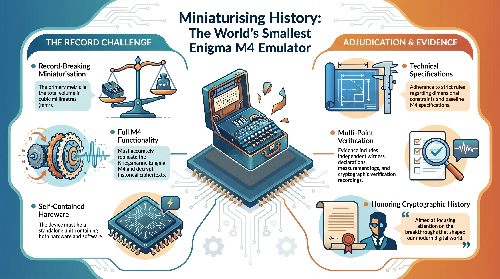

# Smallest Enigma Emulator: Guinness World Record Attempt

**Record Title:** "The smallest volume (mm³) of a self-contained hardware device capable of executing a fully functional M4 Enigma cipher algorithm."

  

## Introduction

This repository serves as the official entry point for the Technical Specifications and Record Attempt documentation for a Guinness World Records application. 

The objective is to design, deploy, and verify the smallest possible self-contained **Enigma M4** machine emulator (hardware + software) that accurately replicates the cryptographic functions of a legitimate World War II Kriegsmarine Enigma M4 machine and can successfully decrypt historical ciphertexts.

The Enigma machine was a famously complex electro-mechanical rotor cipher device used extensively by Nazi Germany during World War II to protect highly classified military communications. It has since become a global symbol of the birth of modern computing and cryptanalysis, popularized in recent years by the Oscar-winning film *The Imitation Game*. The film chronicled the monumental and top-secret efforts of Alan Turing and the brilliant team at Bletchley Park, whose success in breaking the seemingly unbreakable Enigma code proved to be a decisive turning point in the war.

  
   
  <em>Bletchley Park Naval Enigma</em>

**Beyond the technical challenge of extreme miniaturization, this record attempt serves a broader purpose. It is intended to focus public attention on the paramount importance of scientific research, specifically in the field of cryptography. The cryptographic breakthroughs achieved during the latter stages of World War II were the main drivers of crucial historical events, ultimately shaping not only the outcome of the conflict but the foundation of our modern, digitally interconnected world.**

To facilitate adjudication and public review, the documentation has been organized into two primary documents:

### 1. [Record Specification](./RECORD_SPECIFICATION.md)
Contains the strict technical rules governing the emulator, the dimensional constraints, and the baseline specifications of the original historical Enigma M4.

### 2. [Record Attempt & Evidences](./RECORD_ATTEMPT.md)
Contains the formal application details, the measurement and cryptographic verification methodologies, the independent witness declarations, and the comprehensive Evidence Inventory (videos, logs, photos).

---
*Maintained for Guinness World Record Adjudication.*
