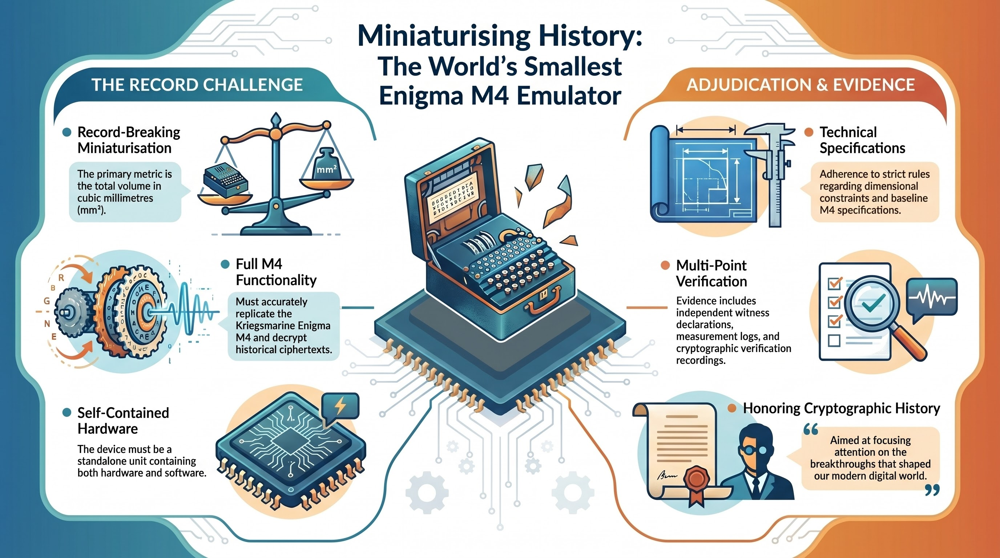

# Smallest Enigma Emulator: Technical Specifications & Engineering Experiment

**Project Objective:** Design and verify the smallest fully functional Enigma M4 machine emulator implemented on commercially available hardware.

  

## Introduction

This repository serves as the technical documentation and verification report for a private engineering experiment in cryptographic hardware miniaturization.

The objective is to design, deploy, and verify the smallest possible, self-contained, fully functional **Enigma M4** emulator using strictly commercially available hardware. The device accurately replicates the complete cryptographic behavior of a World War II Kriegsmarine Enigma M4 machine and successfully decrypts authentic historical ciphertexts.

The Enigma machine was a famously complex electro-mechanical rotor cipher device used extensively by Nazi Germany during World War II to protect highly classified military communications. It has since become a global symbol of the birth of modern computing and cryptanalysis, popularized in recent years by the Oscar-winning film *The Imitation Game*. The film chronicled the monumental and top-secret efforts of Alan Turing and the brilliant team at Bletchley Park, whose success in breaking the seemingly unbreakable Enigma code proved to be a decisive turning point in the war. 

**Today, Alan Turing is widely recognized not only for his pivotal role in cryptanalysis but is also considered, if not the father, a fundamental precursor to modern Artificial Intelligence.**

  
   
  <em>Bletchley Park Naval Enigma</em>

**Beyond the technical challenge of extreme miniaturization, this engineering experiment explores the limits of compact embedded systems while honoring the history of cryptography. The cryptographic breakthroughs achieved during the latter stages of World War II were the main drivers of crucial historical events, ultimately shaping not only the outcome of the conflict but the foundation of our modern, digitally interconnected world.**

The documentation is organized into two primary sections:

### 1. [Technical Specification](./RECORD_SPECIFICATION.md)
Contains the strict technical rules governing the emulator, the dimensional constraints, and the baseline specifications of the original historical Enigma M4.

### 2. [Implementation & Verification](./RECORD_ATTEMPT.md)
Contains the hardware implementation architecture, physical measurement methodology, cryptographic verification results, and reproducible verification artifacts (video recordings, logs, test scripts).

## Disclaimer 

This project is an independent engineering experiment and is not endorsed by, sponsored by, or affiliated with the Bletchley Park Trust, The National Museum of Computing (TNMOC), or any other organization. All trademarks and registered trademarks are the property of their respective owners.

